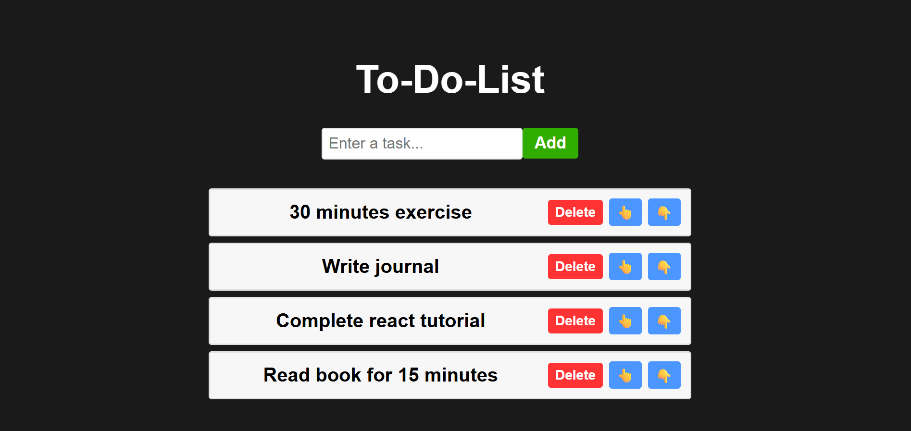

# 📝 React To-Do List App

A simple and interactive to-do list built with React. This app lets users add tasks, remove them, and rearrange them by moving up or down in the list.

---

## 🚀 Features

- ✅ **Add Task** — Quickly add a new task to your to-do list.
- ❌ **Remove Task** — Delete any task with a single click.
- ⬆️ **Move Up** — Rearrange your tasks by moving them upward.
- ⬇️ **Move Down** — Shift tasks downward to organize priorities.

---

## 🌐 Demo

---

## 🌐 Live Demo

🔗 [Click here to view the app](https://nikunj-52147.github.io/To-do-list-App/)

---

## 🛠️ Tech Stack

- React (with Hooks)
- HTML + CSS (or Tailwind/Bootstrap if used)
- Vite (or CRA if used)

---
